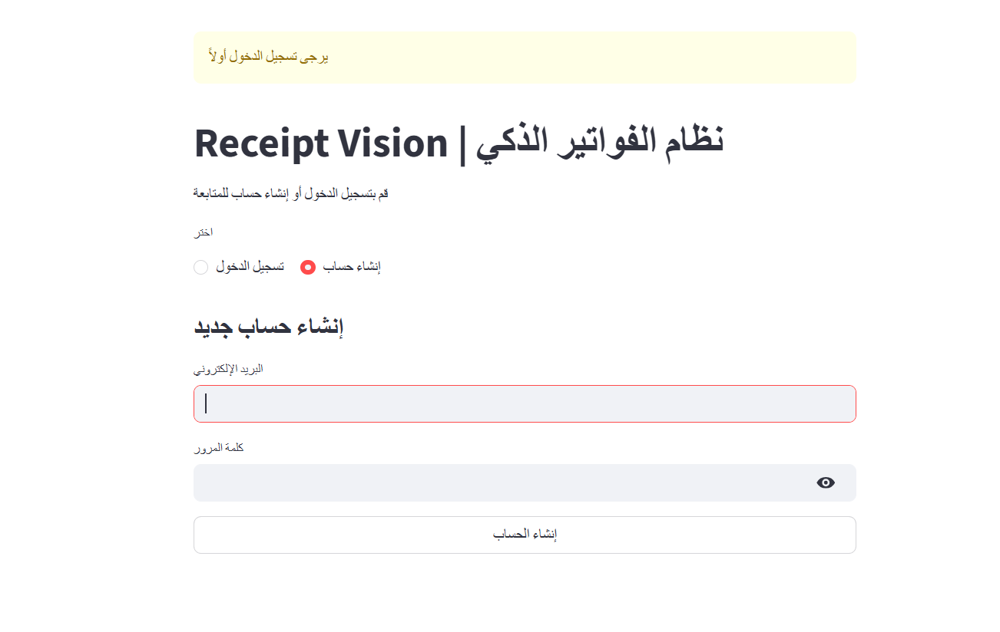
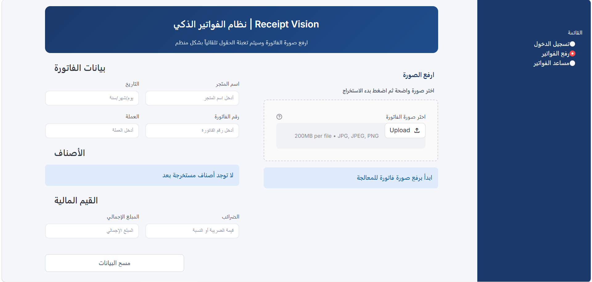
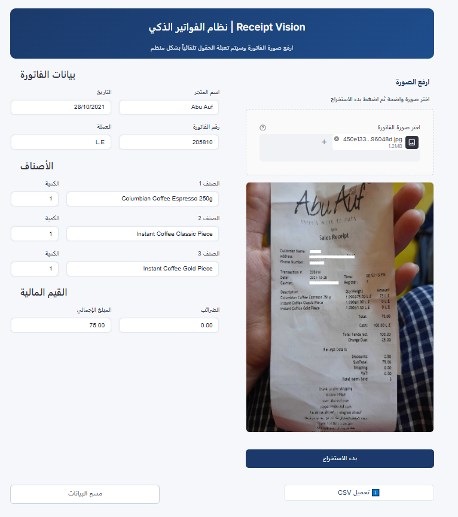
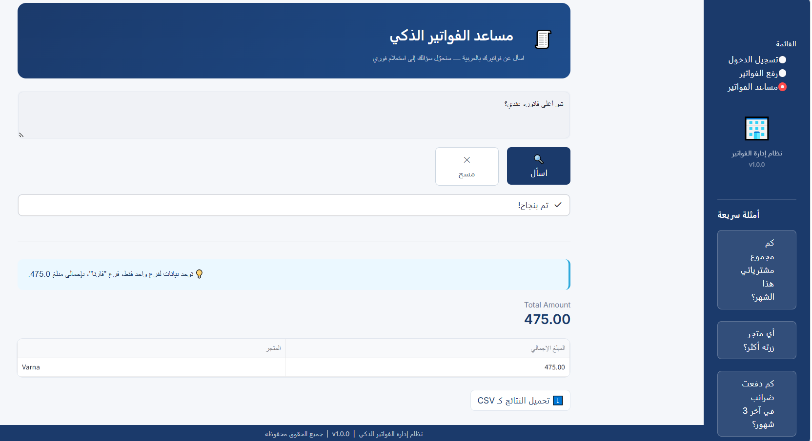
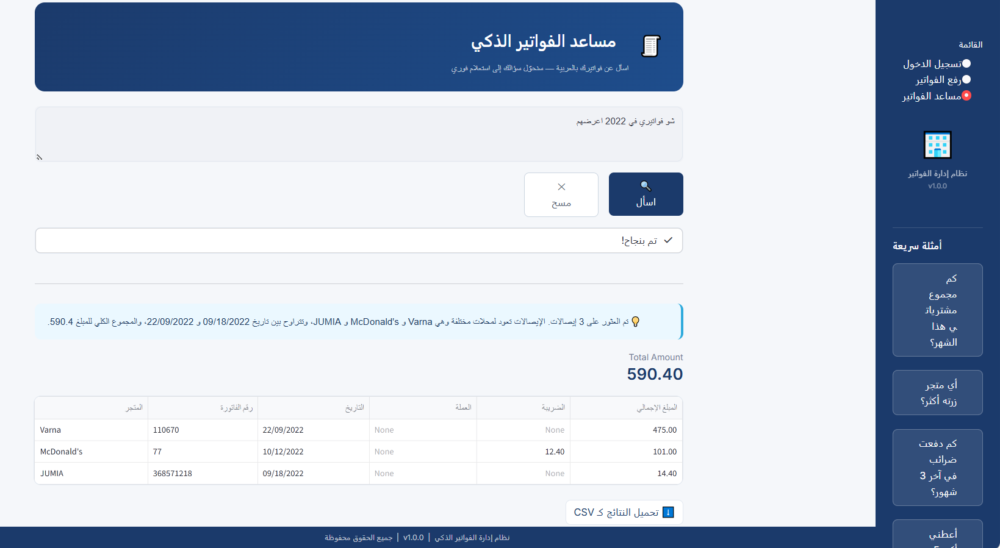

# ReceiptVision 

[](https://www.python.org/)
[](https://fastapi.tiangolo.com/)
[](https://streamlit.io/)
[](https://www.docker.com/)

AI-powered receipt data extraction system that converts images into structured data. Built with FastAPI and Streamlit, containerized with Docker for seamless deployment.

---

## Technical Features

- **Smart Image Processing:** Automatic quality enhancement before OCR — see [test/image_processing.md](test/image_processing.md)
- **Structured Data Output:** Clean JSON format for easy integration
- **Instant Results:** Upload and extract in seconds
- **Auto-Save:** Direct database storage without manual steps
- **Dual Interface:** RESTful API for integration, Streamlit UI for interactive use
- **Receipts Assistant:** Arabic Q&A interface for asking questions about saved receipts
- **Secure Access:** Token-based authentication for upload and assistant pages
- **Container Support:** Docker and Docker Compose ready

---

## Architecture

```
┌─────────────┐      ┌──────────────┐      ┌──────────────┐
│  Streamlit  │ ───> │   FastAPI    │ ───> │  Image Pre-  │
│     UI      │      │   Backend    │      │  processing  │
└─────────────┘      └──────────────┘      └──────────────┘
                            │                      │
                            │                      ▼
                            │               ┌─────────────┐
                            │               │ OCR Engine  │
                            │               └─────────────┘
                            │                      │
                            │                      ▼
                            │               ┌─────────────┐
                            │───────────────│ LLM Parser  │
                            │               │   (JSON)    │
                            │               └─────────────┘
                            ▼                     
                     ┌──────────────┐ 
                     │   Database   │
                     │   Storage    │
                     └──────────────┘
```

**Pipeline Stages:**
1. Upload receipt image via Streamlit UI
2. Image gets preprocessed for better quality
3. OCR engine extracts text from the image
4. LLM parses text into structured JSON
5. Data automatically saves to database

---

## Demo
### Register/Login


### Upload 


### Main App


### Receipts Assistant
The Streamlit app also includes a receipts assistant page for querying saved receipts in Arabic. You can ask questions such as:

- Total spending this month
- Most visited store
- Taxes paid over a period
- Top receipts by amount

#### How the idea works
1. The user writes a question in Arabic.
2. The backend converts the question into a structured SQL query.
3. The query runs on the receipts database.
4. The assistant returns a short explanation and the result rows.

#### Example flow





---

**Extraction Schema:**

| Field | Description |
|-------|-------------|
| store_name | Name of the store/merchant |
| receipt_number | Receipt or invoice number |
| date | Transaction date |
| currency | Currency code (USD, EUR, etc.) |
| items | List of purchased items with quantities  |
| taxes | Tax amount |
| total_amount | Total transaction amount |

---

## Data Format

### Input
Receipt image in JPG, PNG, or JPEG format

### Output

```json
{
    "store_name": "Caribou Coffee",
    "receipt_number": "90535",
    "date": "23/10/2021",
    "currency": "LE",
    "items": [
        {
            "item_name": "Espresso L",
            "quantity": "1"
        }
    ],
    "taxes": "4.67",
    "total_amount": "38.00"
}
```

---

## Evaluation

The current benchmark in [test/results.md](test/results.md) was run on 50 receipts. Overall, the pipeline is working well for core receipt fields, while item-level extraction still has room to improve.

| Metric | Score |
|--------|-------|
| Store name accuracy | 80.0% |
| Receipt number accuracy | 90.0% |
| Date accuracy | 94.0% |
| Currency accuracy | 98.0% |
| Item name accuracy | 75.3% |
| Quantity accuracy | 100.0% |

Most reliable fields are currency, date, and quantity. The main weakness is item name extraction, especially on noisy, multilingual, or crowded receipts.

---

## Installation

Clone the repository and set up environment:

```bash
git clone https://github.com/haneenfadi/receipt-ocr-pipeline.git

```

### Environment Configuration

```bash
cp .env.example .env
```

Edit `.env`:
```dotenv
API_AUTH_PASSWORD="your-auth-password"
GROQ_API_KEY="your-groq-api-key"
MISTRAL_API_KEY="your-mistral-api-key"
APP_ENV="dev"
```

---

### Local Development

```bash
python -m venv ocr
source ocr/bin/activate  # Windows: ocr\Scripts\activate
pip install -r requirements.txt
```

### Docker Deployment

```bash
docker-compose up -d
```

---

## Usage

### Streamlit Interface

```bash
streamlit run src/app/streamlit_app.py
```

Access at `http://localhost:8501`

The Streamlit app includes both the receipt upload page and the receipts assistant page.

### FastAPI Endpoint

```bash
uvicorn src.app.api:app --reload --host 0.0.0.0 --port 8000
```

API available at `http://localhost:8000`  
Interactive documentation: `http://localhost:8000/docs`


**Request Example:**

```bash
curl -X POST "http://localhost:8000/api/v1/receipt_parser/upload" \
  -H "accept: application/json" \
    -H "Authorization: Bearer your-access-token" \
  -F "file=@/path/to/receipt.jpg"
```

---

### Testing with Postman

**Endpoint:** `POST http://localhost:8000/api/v1/receipt_parser/upload`

**Request:**
- Method: `POST`
- Body: `form-data`
- Key: `file` (type: File)
- Value: Select your receipt image

**Headers:**
```
Content-Type: multipart/form-data
```

**Response:** JSON with extracted receipt data

---
## Project Structure
```
OCR/
│
├── Dockerfile                      # Container definition
├── docker-compose.yml              # Multi-container orchestration
├── .dockerignore                   # Docker build exclusions
├── .gitignore                      # Git tracking exclusions
├── .env.example                    # Environment variables template
├── requirements.txt                # Python dependencies
├── README.md                       # Project documentation
│
├── aux-files/                      # Auxiliary files
│   └── streamlit_app.PNG           # UI screenshot
│
├── db/                             # Database layer
│   ├── database.py                 # Database tables creation
│   ├── db_maintenance.py           # Database maintenance
│   └── stored_receipts/            # Stored receipt images
│   
└── src/                            # Source code
    │
    ├── __init__.py                # Package initializer
    ├── app/
    │   ├── __init__.py            # App package initializer
    │   ├── api.py                  # FastAPI backend
    │   ├── streamlit_app.py        # Streamlit interface
    │   └── app_pages/              # Streamlit pages
    │       ├── login.py            # Login / register page
    │       ├── upload.py           # Receipt upload page
    │       └── ask_receipts.py     # Receipts assistant page
    │
    ├── assets/
    │   └── streamlit.css           # Streamlit styling
    │
    ├── config/
    │   ├── __init__.py
    │   └── settings.py             # Application configuration
    │
    ├── ocr/
    │   ├── mistral_ocr.py          # OCR engine
    │   └── parsing.py              # LLM JSON parser
    │
    ├── receipts/                   # Sample receipt images
    │
    ├── search_in_receipts/
    │   ├── __init__.py
    │   ├── talk_to_sql.py          # Text-to-SQL assistant logic
    │   └── test_text_sql.py        # Text-to-SQL test script
    │
    ├── routes/
    │   ├── auth_router.py         # Authentication endpoints
    │   ├── base.py                # Base routes
    │   ├── receipt_parser.py      # Receipt parsing endpoints
    │   └── receipts_assistant.py  # Receipts assistant API
    │
    ├── utils/
    │   ├── image_preprocessing.py  # Image enhancement
    │   ├── ip_whitelist.py         # IP filtering
    │   ├── schema.py               # Pydantic schemas
    │   └── security.py             # Auth and DB helpers
    │
    └── test/                       # Testing suite
        ├── evaluate.py             # Model evaluation script
        ├── test_images_original_ocr.py   # Test OCR on original images
        ├── test_images_processed_ocr.py  # Test OCR on preprocessed images
        ├── test_parsing_one_file.py      # Single file parsing test
        │
        ├── ground_truth.json       # Ground truth labels
        ├── predictions.json        # Model predictions
        ├── evaluated_results.md    # Evaluation metrics
        ├── results.md              # Test results summary
        ├── image_processing.md     # Image processing notes
        │
        ├── json_outputs/           # Parsed JSON outputs
        │   ├── ar_image(1-8).json
        │   └── ar_image(15-16).json
        │
        └── ocr_outputs_txt/        # Raw OCR text outputs
            ├── ar_image(1-16).txt
            └── en_image(1,7).txt
```

---

## Best Practices

-  Use clear, well-lit images 
-  The system automatically handles most quality issues through preprocessing
-  All extracted data is saved immediately to the database

---


## Security

- Environment variables stored in `.env` 
- API authentication support

---

## Author

**Haneen Fadi**  
GitHub: [@haneenfadi](https://github.com/haneenfadi)  
Email: haneenqutishat03@gmail.com

---