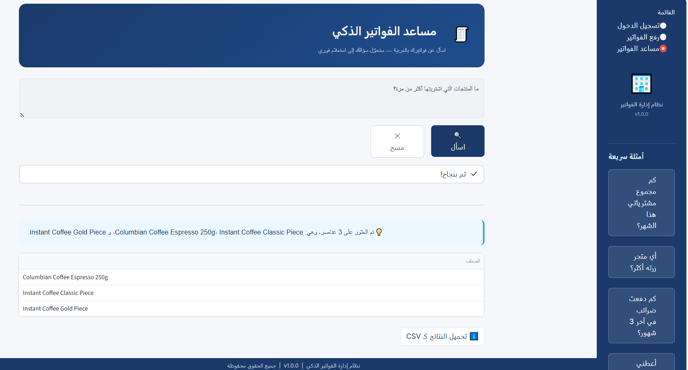

## Receipts Assistant - Text to SQL

The receipts assistant is an Arabic question-answering feature built on top of the saved receipts database. Its main idea is to convert natural language into a SQL query, so the user does not need to know SQL to search their receipts.

### How the idea works

1. The user writes a question in Arabic.
2. The backend interprets the intent and maps it to the receipt fields.
3. The system generates a SQL query over the receipts database.
4. The query runs and returns matching rows.
5. The assistant summarizes the result in Arabic and shows a table when needed.

This makes it possible to ask questions like:

- كم صرفت هذا الشهر؟
- أي متجر زرته أكثر؟
- كم دفعت ضرائب خلال فترة معينة؟
- ما هي أكبر الفواتير؟

### Screenshots

#### Assistant page

#### Example query flow

### Why Text to SQL

This approach gives the user a simpler interface than raw database access. Instead of exposing SQL, the assistant turns language into structured queries and returns the answer in a readable form. That keeps the experience friendly while still using the full power of the database.

### Output behavior

- Short Arabic insight for the user
- Matching table when rows are returned
- CSV download for the displayed results when available

